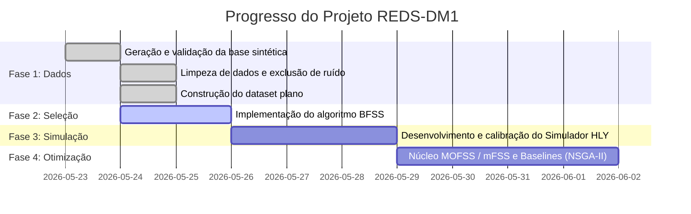

# Otimização do Tempo de Vida Saudável na DM1
## Maximizar Anos de Vida Saudáveis (HLY) a partir da base REDS-PE

---

## 1. Objeto do Projeto

O projeto tem como objetivo principal **otimizar o tempo de vida saudável** de pessoas diagnosticadas com **Diabetes Mellitus Tipo 1 (DM1)** em Pernambuco. Em termos práticos, busca-se descobrir qual combinação de estratégias de cuidado e de alocação de recursos públicos maximiza os **Anos de Vida Saudáveis (Healthy Life Years - HLY)** da população atendida pelo SUS no estado, respeitando restrições reais de custo orçamentário e de capacidade logística do sistema.

> [!NOTE]
> A predição de óbito e a estratificação individual de risco **não fazem parte do núcleo do projeto**. Elas servem como funções auxiliares para o simulador, mas o entregável central é a **otimização de políticas de saúde** a nível populacional (encontrar boas regras de alocação, e não rotular pacientes individualmente).

---

## 2. Evidência que Sustenta o Ganho de HLY

A literatura médica e o **T1D Index** mostram que o controle glicêmico medido pela Hemoglobina Glicada (HbA1c) é o principal determinante modificável de complicações e mortalidade em pacientes com DM1. 

A transição progressiva de cenários de cuidado altera diretamente a expectativa de anos de vida saudáveis da população no Brasil, servindo como âncoras para calibrar o simulador:

| Cenário de Cuidado | Média de HbA1c Esperada | Anos Saudáveis (HLY) | Significado no Otimizador |
| :--- | :---: | :---: | :--- |
| **Cuidado Mínimo (Status quo)** | ~12.5% | **43.2** | Ponto de partida (linha de base) |
| **Diagnóstico Oportuno** | ~12.5% | **43.2** | Ganho marginal isolado |
| **Insulina + Fitas de Glicemia** | ~9.0% | **46.1** | Salto relevante de baixo custo |
| **Bombas de Insulina + CGMs (Sensores)** | ~8.0% | **54.2** | Maior ganho de HLY, maior custo operacional |

*Fonte: T1D Index (Brasil) e Gregory et al. (2020), Pediatric Diabetes, doi:10.1111/pedi.12988.*

---

## 3. Técnicas de Computação Natural Selecionadas

Para atingir as metas do cronograma, o projeto foi estruturado em três papéis bioinspirados:

| Papel no Projeto | Técnica Recomendada | Justificativa Técnica |
| :--- | :--- | :--- |
| **Pré-processamento (Seleção de Variáveis)** | **BFSS / wFSS** (Binary Fish School Search) | Reduz o espaço de busca clínico. Atua em cima do dataset dummificado e estruturado para selecionar o conjunto mínimo de variáveis preditivas de HbA1c/HLY, eliminando redundâncias e acelerando o simulador. |
| **Otimização Principal (Núcleo)** | **MOFSS / mFSS** (Multi-Objective/Mixed-Variable Fish School Search) | Otimiza as variáveis de decisão (mistura de parâmetros discretos de tratamento, inteiros de insumos e contínuos de cobertura) para gerar a Frente de Pareto (HLY $\times$ Custo $\times$ Equidade). |
| **Otimização Alternativa (Baseline)** | **NSGA-II** (Algoritmo Genético) e **PSO** (Particle Swarm) | O NSGA-II serve como o padrão de comparação na literatura de alocação de recursos em saúde. O PSO atua como baseline para validação mono-objetivo. |

---

## 4. Formulação Lógica do Problema

### A. Variáveis de Decisão (O que o otimizador controla)
*   **Estratégia de Cuidado** alocada para cada perfil de paciente (Discreta: mínimo, insulina+fitas, bombas+CGM).
*   **Cobertura / Fração de Pacientes** atendida por estratégia em cada regional de saúde (Contínua, 0 a 1).
*   **Alocação Física de Insumos** por município (Inteira: número de bombas, sensores de glicose e kits de fita distribuídos).
*   **Intensidade de Monitoramento** (Inteira: frequência alvo de exames de HbA1c por paciente ao ano).

### B. Funções Objetivo (O que se quer maximizar/minimizar)
1.  **Maximizar HLY Médio da População:** Estimado pelo simulador com base nas trajetórias de HbA1c induzidas pela alocação de tratamentos.
2.  **Minimizar Custo Total da Política:** Custo unitário de insumos (bombas, sensores, fitas, consultas) $\times$ Cobertura regional $\times$ População local de DM1.
3.  **Maximizar Equidade Regional:** Evitar a concentração de recursos tecnológicos apenas nos grandes centros (como Recife e RMR), distribuindo as tecnologias de forma proporcional e equitativa no interior.

### C. Restrições Operacionais
*   **Teto Orçamentário:** Limite financeiro anual máximo para aquisição e logística de insumos de saúde.
*   **Capacidade Logística:** Limites de distribuição de insumos e exames por município/GERES.
*   **Piso de Equidade:** Garantia de cobertura mínima para todas as regiões de saúde do estado de Pernambuco.

## 5. Criação e Geração da Base Sintética (REDS-DM1)

Devido às restrições legais da LGPD e à sensibilidade de dados médicos individuais, foi gerada uma base de dados relacional sintética contendo 15.000 registros de atendimentos. A geração utiliza um **motor híbrido** que combina dados estatísticos clínicos reais com regras geodemográficas e sanitárias do SUS em Pernambuco.

### O Processo de Geração (UCI Kaggle + IBGE + SUS)
A base foi construída seguindo as diretrizes do plano de geração de dados sintéticos:

1. **Amostragem Clínica Base (Kaggle 130-US):** O dataset de referência é o *Diabetes 130-US Hospitals*, contendo dados clínicos reais de internações.
2. **Consolidação de Pacientes (1:N):** Os registros foram agrupados por `patient_nbr` para isolar o prontuário único do paciente (`PACIENTE`) de suas múltiplas visitas no tempo (`ATENDIMENTO`), mantendo a integridade relacional.
3. **Localização Geodemográfica (IBGE-PE):** A lista de municípios foi coletada da API de Localidades do IBGE. Foi criada uma distribuição probabilística baseada na população real de cada município de Pernambuco para sortear o município de residência (`NM_MUNIC`).
4. **Tradução Clínica para o SUS:**
   * **Diagnósticos (ICD-9 para CID-10):** Os códigos norte-americanos foram traduzidos para CIDs correspondentes (ex: faixa 250.xx mapeada para `E10` de diabetes tipo 1 em jovens; e problemas renais 580-589 mapeados para `N18`).
   * **Resultados de HbA1c:** Os dados categóricos qualitativos do Kaggle (`Normal`, `>7`, `>8`) foram transformados em valores decimais contínuos reais usando amostragens de **distribuição normal truncada** para simular o resultado do exame de laboratório.
   * **Medicamentos (EUA para RENAME):** Fórmulas comerciais americanas foram traduzidas para o padrão RENAME do SUS (Cloridrato de Metformina, Insulina Humana NPH, Insulina Humana Regular e Glibenclamida).
5. **Classificação de Risco (Triagem Manchester):** O grau de urgência da admissão do Kaggle foi mapeado logicamente para as cores e descrições do Protocolo de Triagem de Manchester (ex: `Emergency` $\rightarrow$ Vermelho/Laranja; `Urgent` $\rightarrow$ Amarelo).
6. **Histórico de Imunização:** Registros probabilísticos de vacinação contra *Influenza* e *Pneumocócica 23* foram acoplados com base nas metas de cobertura do DATASUS para grupos prioritários de DM1.
7. **Validação Cronológica e de Integridade:** O script garantiu a consistência das restrições temporais ($\text{Data de Nascimento} < \text{Data de Vacina} < \text{Data de Triagem} \le \text{Admissão} \le \text{Alta/Óbito}$) e a integridade de chaves estrangeiras.

---

## 6. Variáveis Clínicas Mapeadas (REDS)

O simulador de HLY consome variáveis clínicas e demográficas estruturadas, filtrando qualquer dado ruidoso ou administrativo (como CPFs, nomes e e-mails fictícios). O espaço de atributos de entrada foi estruturado em **19 variáveis essenciais**:

| Tabela de Origem | Variáveis Mantidas | Papel no Simulador de HLY |
| :--- | :--- | :--- |
| **`PACIENTE`** | `NU_IDADE`, `IN_SEXO`, `NM_MUNIC`, `DS_RACA` | Estratificação demográfica e epidemiológica para cálculo de risco ajustado e equidade regional. |
| **`ATENDIMENTO`** | `DS_TIPO_ATEND`, `DS_ESPECI`, `TEMPO_INTERNACAO_DIAS` | Complexidade da admissão (ex: admissão por urgência de cetoacidose) e duração da internação (indicativo de custo). |
| **`ACOLHIMENTO`** | `DS_COR_RISCO`, `DS_CLASSIF_RISCO` | Gravidade do quadro agudo no momento da entrada no sistema SUS (Manchester). |
| **`RES_EXAME`** | `EXAME_HBA1C` | Marcador-chave de controle glicêmico. A trajetória da HbA1c determina o ganho ou perda de anos de vida saudáveis. |
| **`PRESCRICAO_MEDICAMENTO`** | `MED_METFORMINA`, `MED_INSULINA_NPH`, `MED_INSULINA_REGULAR`, `MED_GLIBENCLAMIDA` | Identificam o regime terapêutico ativo do paciente. É a base de validação da política de tratamento. |
| **`ATEND_DIAGNOS`** | `IS_RENAL`, `IS_CARDIOVASCULAR` | Comorbidades baseadas no CID-10 (`N18` para doença renal crônica; `I21/I50/I10/I64` para cardiopatias). Utilizadas para aplicar os descontos de incapacidade no HLY. |
| **`PACIENTE (Desfecho)`** | `FL_OBITO` | Desfecho clínico definitivo do prontuário para cálculo de sobrevivência. |

> [!IMPORTANT]
> **Resolução de Ambiguidade:** O BFSS/wFSS não vasculha o banco original inteiro (que contém CPFs, telefones e logs irrelevantes). Ele é aplicado sobre o dataset acima (já higienizado e expandido após dummificação), selecionando a melhor combinação destas colunas que minimiza o erro de predição de desfecho do simulador.

---

## 7. Status do Projeto

### A. O que foi feito até agora (Concluído)
*   **Geração e Validação da Base Sintética:** População do banco de dados relacional com 15.000 registros consistentes, cruzando dados estatísticos clínicos com a API demográfica do IBGE e regras de triagem e imunização do SUS.
*   **Higienização e Filtragem de Dados:** Limpeza completa do banco original para eliminação de dados fictícios ruidosos, informações de TI/auditoria e localizações de granularidade excessiva.
*   **Consolidação Clínica:** Cruzamento de prontuários com registros de atendimentos para gerar uma base estruturada com 19 variáveis clínicas de interesse.

### B. Próximos Passos (Plano de Ação)
1.  **Implementação do BFSS:** Desenvolvimento do algoritmo de seleção de atributos por cardume binário para atuar sobre o conjunto de dados clínicos consolidado.
2.  **Calibração do Simulador de HLY:** Criar a classe do simulador que traduz o impacto do controle glicêmico (HbA1c) e das comorbidades na expectativa de vida saudável, ancorado nos dados do T1D Index.
3.  **Desenvolvimento do Otimizador MOFSS / mFSS:** Desenvolver o algoritmo do cardume multiobjetivo para otimizar as coberturas regionais e insumos de DM1.
4.  **Desenvolvimento dos Baselines:** Implementar NSGA-II e PSO para comparação de performance da alocação de recursos.
5.  **Geração dos Relatórios de Pareto:** Plotar a frente de Pareto comparativa para subsidiar a tomada de decisão do gestor estadual de saúde.
